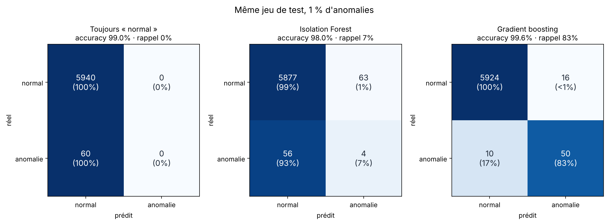

# ai-eval-lab


Évaluer un modèle d'IA, c'est souvent là que tout coince. Ce dépôt montre deux pièges avec du code qui tourne en quelques secondes, sans GPU ni clé API :

1. **Le piège de l'accuracy** sur des données déséquilibrées (détection d'anomalies).
2. **L'évaluation d'un RAG** : mesurer la recherche et la réponse séparément, comparer deux versions question par question, et vérifier que le contrôle automatique est fiable.

C'est le code de l'épisode 1 de ma série LinkedIn sur les goulots d'étranglement de l'IA.

## 1. Le piège de l'accuracy

```bash
python anomalies/accuracy_trap.py
```

Jeu de test synthétique de 6 000 points, dont 60 anomalies (1 %) :

| Modèle | Accuracy | Précision | Rappel | F1 |
|---|---|---|---|---|
| Toujours « normal » | 99,0 % | 0 % | 0 % | 0,00 |
| Isolation Forest | 98,0 % | 6,0 % | 6,7 % | 0,06 |
| Gradient boosting (classes pondérées) | 99,6 % | 75,8 % | 83,3 % | 0,79 |

L'accuracy varie de moins de 2 points entre les trois modèles. Le rappel, lui, va de 0 % à 83 % : le premier modèle ne détecte aucune anomalie et l'Isolation Forest en rate 56 sur 60.



La couleur suit le pourcentage de chaque ligne. Sans ça, les 5 940 points normaux écrasent l'échelle et la ligne des anomalies devient invisible.

## 2. Évaluer un RAG

```bash
python -m rag_eval.evaluate --retriever words
python -m rag_eval.evaluate --retriever chars --baseline results/rag_words.json --labels rag_eval/labels_chars.json
```

Le corpus contient 12 fiches courtes sur les métriques d'évaluation (`rag_eval/corpus/`). Le jeu de test de référence (`rag_eval/golden_set.jsonl`) contient 24 questions, chacune avec le document attendu et les mots-clés qu'une bonne réponse doit contenir. Deux moteurs de recherche TF-IDF sont comparés : sur les mots, et sur des morceaux de 3 à 5 caractères.

| Moteur | recall@1 | recall@3 | MRR | Réponses justes (mots-clés) |
|---|---|---|---|---|
| `words` | 83 % | 96 % | 0,89 | 58 % |
| `chars` | 83 % | 100 % | 0,92 | 58 % |

Trois choses ressortent de ces chiffres.

**Une moyenne identique peut cacher des régressions.** Les deux moteurs ont 58 % de réponses justes. Question par question, `chars` en corrige deux (q09, q15) et en casse deux autres (q01, q07). Sans comparaison au run précédent, on ne le voit pas.

**La recherche et la réponse se mesurent séparément.** Pour q12 et q13, le bon document arrive premier, mais la phrase extraite définit le déséquilibre des classes au lieu de dire quoi faire. Le problème est dans la génération, pas dans la recherche.

**Le contrôle automatique se trompe aussi.** Comparé aux annotations manuelles (`rag_eval/labels_chars.json`), le contrôle par mots-clés est d'accord à 92 % (kappa de Cohen 0,83). Ses deux erreurs sont des faux positifs : pour q15, la réponse parle d'une alerte qui « coûte » du temps et valide le mot-clé « coût » sans répondre à la question. C'est pour ça qu'un juge automatique, mots-clés ou LLM, se calibre sur un échantillon annoté à la main avant qu'on lui fasse confiance.

### Juge LLM (optionnel)

```bash
pip install anthropic
export ANTHROPIC_API_KEY=...
python -m rag_eval.evaluate --retriever chars --judge --labels rag_eval/labels_chars.json
```

Le juge note chaque réponse CORRECT ou INCORRECT, et son accord avec les annotations manuelles s'affiche à côté de celui des mots-clés. Le modèle se règle avec la variable `JUDGE_MODEL`.

## Installation

```bash
python -m venv .venv
source .venv/bin/activate      # Windows : .venv\Scripts\activate
pip install -r requirements.txt
pytest
```

## Structure

```
anomalies/accuracy_trap.py   piège de l'accuracy + matrices de confusion
rag_eval/corpus/             12 fiches sur les métriques d'évaluation
rag_eval/golden_set.jsonl    24 questions avec document et mots-clés attendus
rag_eval/metrics.py          recall@k, MRR, contrôle par mots-clés, comparaison de runs
rag_eval/judge.py            juge LLM optionnel + accord avec les annotations (kappa)
rag_eval/evaluate.py         lance l'évaluation, compare, sauvegarde en JSON
results/                     sorties des derniers runs
tests/                       tests pytest, lancés à chaque push par GitHub Actions
```

## Limites

Les données de la partie 1 sont synthétiques. Le RAG de la partie 2 renvoie une phrase extraite du document au lieu d'appeler un LLM, pour que tout tourne hors ligne. Le but est de montrer la méthode d'évaluation, pas la qualité du système évalué.

## Licence

MIT
